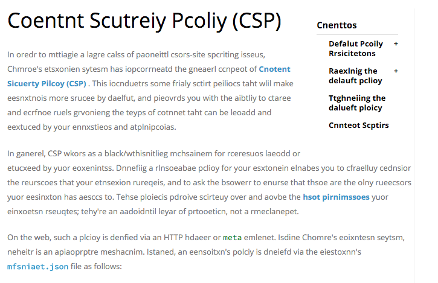

# Dyslexia Chrome Extension

> Jumble text to simulate reading with dyslexia.



## Setup

```
$ git clone git@github.com:akenn/dyslexia-chrome.git
$ cd dyslexia-chrome
```

## Use

- Navigate to `chrome://extensions/` in chrome
- Click `Load unpacked extension`
- Select the `dyslexia-chrome` folder
- Profit!

## Building and Making Changes

```
$ npm install
$ npm run build
```

## Todo

- support toggling off
